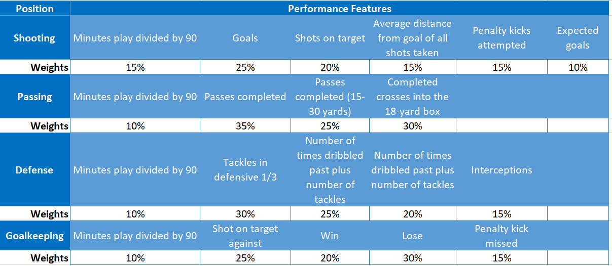
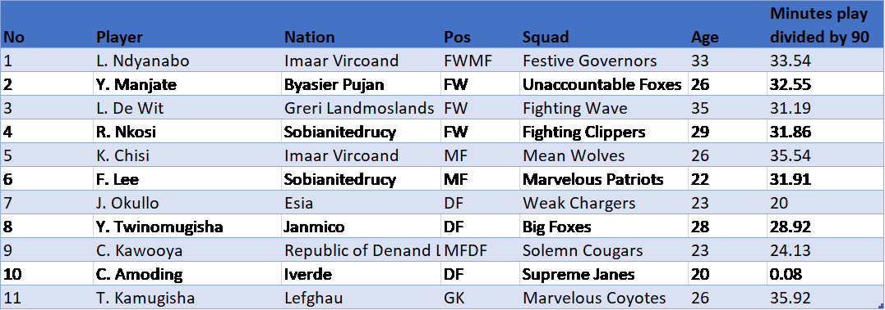
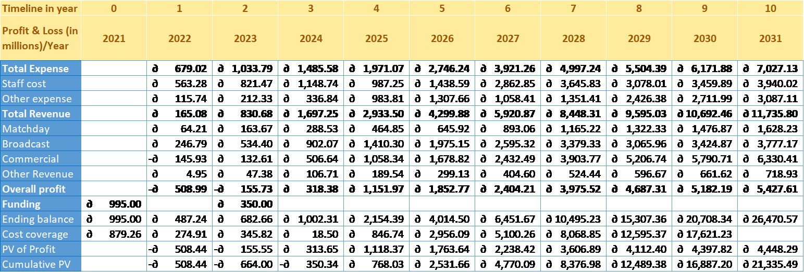
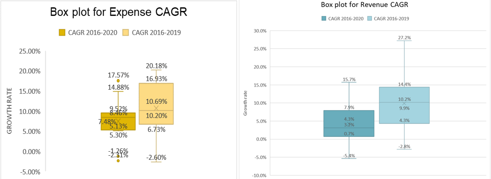
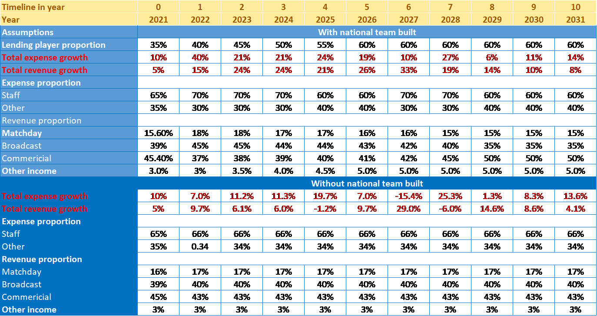
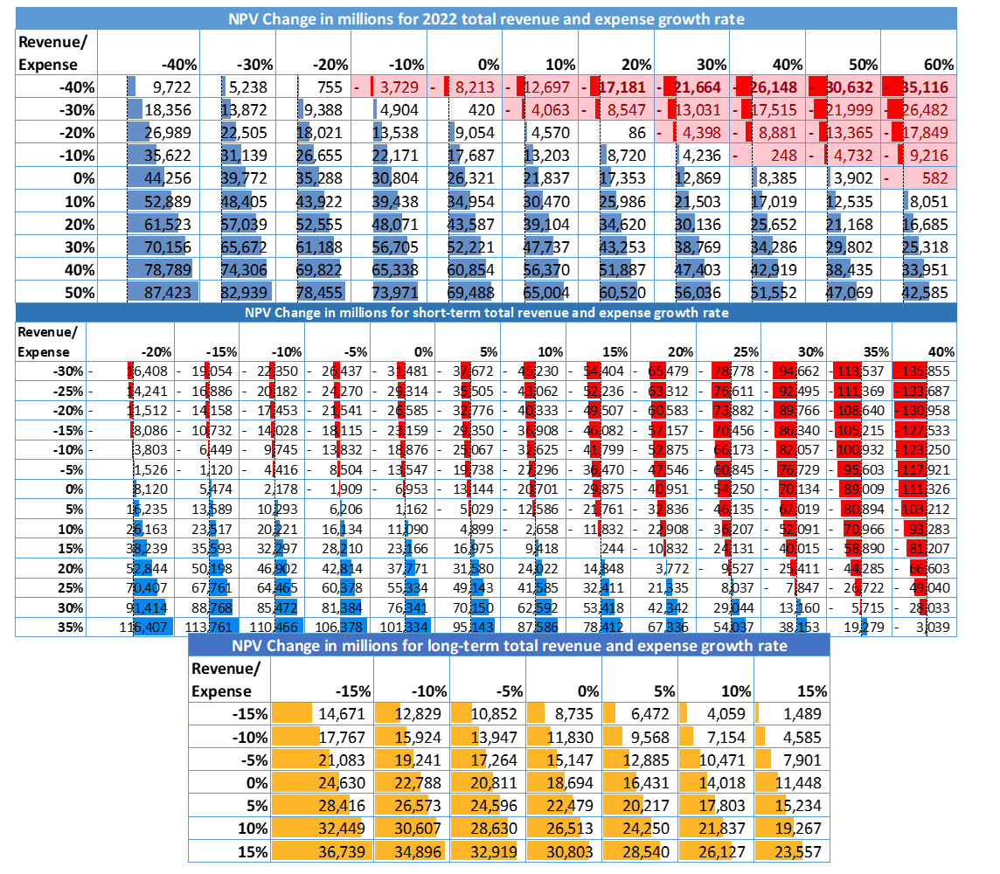

# SOA Challenge: Rarita FSA League Project Showcase

By ML Group

---
## Project Overview

This page briefly showcases the results and methodology for constructing Rarita's national football team, key strategies to be implemented, 1o-year profit & loss analysis, relevant economic impacts and risk considerations. We applied machine learning models such as linear regression,shrinkage models and ensemble models for feature selection and also built a discounted cash flow model to present the future profit or loss positions of the strategy proposed. We conducted economic analysis by regions...

> To find more details on the SOA Challenge, please click [2022 SOA Research Challenge](https://www.soa.org/research/opportunities/2022-student-research-case-study-challenge/).

## Project Objectives

The project aims to  help Rarita form a competitive national football team, which is expected to boost the country’s economy. With the competitiveness defined as follows:

>
* The national team should rank within the top ten members of the FSA for the season within the next five years.
* There is a high probability of achieving an FSA championship within the next 10 years.

With machine learning models used to select players, discounted cash flow models for projecting 10-year revenue and expense and economic analysis conducted, there are many assumptions embedded in the analysis and risks  also he uncertainty of the analysis provided in the report. 

## Team Selection

### Methodology

The modelling steps are outlined below:

>
* Plot correlation matrix to explore the linear relationship between tournament ranking and all player performance features.
* Aggregate player level data to national team level by addition or taking averages of the individual performance variables. 
* Conduct exploratory data analysis to visualize the distinctive impacts of the selected variables on the independent variable, namely the tournament ranking results.
* Use linear, shrinkage and Ensemble models with relatively non-highly-correlated variables as inputs to quantify the relationships between the performance features and output of tournament ranking. 
* Select performance features and assigned weights based on the importance and predictive powers of each variable in the constructed models.
* Rank each performance features selected to eliminate the effects of large value gaps. 
Calculate an overall rank for each player based on weighted average rank of those selected performance features.
* Select 21 players with the highest ranks with filtered positions and substitute players are also selected based on their ranking and age.

> For detailed R code, please click  [R code: linear and shrikange models](linear.R) for linear and shrinkage models, click  [R code: Ensemble models](ensemble.R) for tree-based models, click [R code: exploratory data analysis](data_clearning_exploratory_data_analysis.R) for exploratory data analysis. 

---
**Data limitatoin:**

>
* The ‘Tournament Passing’ and ‘Tournament Defense’ data in 2020 is missing. As player performance features are selected by variable significance, the unavailability of 2020 tournament data disallows the split of training and test datasets on aggregate team level. This can lead to not optimal model chosen to support the process of selecting players.
* There are negative data entries across some columns. We noticed that the negative values approach to zero closely with the lower bound of -0.1 and as we valued the ranking not the numbers, so we do not replace negative values. This may affect the model slightly.
* There are also some missing values across columns in the dataset. If data is missing in this way, we choose MICE algorithm to simulate data for missing value. This may decrease the accuracy of the model.

---

We defined the competitiveness and potentials of players by the overall rank and the selected performance features. The features selected and their relevant weights are outlined below.

#### Assumptions

>
*	All player performance features are measured and recorded reasonably and accurately. The relative values of performance features not the values themselves show the competitiveness of players. 
*	The positions described in four letters are assumed to be the same. The reason for inconsistency in position abbreviation is salary change in the same year.

### National football team player list

We expected the national football team to implement a 4-2-4 flexible strategy consisting of 4 forwards, 2 midfields, 4 defense and 1 goalkeeper. To implement the flexible strategy successfully, at least one forward position and defense position can also play midfield, so the 4-2-4 team structure can easily convert to 3-4-3 or other competitive structures dependent on opponent’s strategy. The 10 replacement players selected and some statistics are outlined below.

> National football team player list

We selected substitute players using the same weighted average ranking with an additional criterion of age. We assumed that average retirement age for all football players is around 35 years old. This means players with current age above 25 are subject to replacement. The 11 players selected and some statistics are outlined below.

>  National football team replacement player list 

## 10-Year Strategy

For the pursuit of world-wide competitiveness, Rarita’s national football team should focus on strategies driving management, brand development, growing commercial revenue and other revenues, improving overall popularity and positions in tournaments. We outlined the three different sources of revenue and based on the profit & loss analysis, we discovered the addtional funding need for Rarita's national football team.

### Sources of revenue and additional funding

All three sources of revenue outlied below significantly rely on brand development to attract new supporters and improve fans base. The growth of revenue can be achieved by both improving rankings in competitions and setting up effective and practical commercialization strategies.

>
* **Matchday revenue:** ticket sales at local stadiums, Stadium tours and loaning out the stadium for filming
* **Broadcast revenue:** TV deals 
* **Commercial revenue:** mechanization including sales of all jerseys, hats, scarves, jackets and badges, large contracts with sponsors.

> Assuming all strategies are successfully practiced, the relevant profit and loss can be estimate with present value of 21335.49 million shown below.

From the projection above, except the initial funding of 995 million doubloons, non-governmental funding is needed at the end of 2023. The funding source of 350 million doubloons can be achieved by multiple long-term extensive commercial sponsorship or transferring team ownership to large corporates or constructing global membership.

### DCF model and methodology

> 
*	Calculate total revenue and expense at the end of 2020 using the product of 2020 population and revenue per capita data.
*	Predict the total expense growth rate and revenue growth rate for each year for 2021 and for future 10 years by analyzing the historical trend and conducting relevant researches
*	Calculate total revenue and expense using the previous year figure timing the growth rate for 2 scenarios with and without national football team built.
*	Substract the predicted figures of the 2 scenarios above to calculate the direct revenue and expense of the national team

> The DCF model for the 2 scenraios is shown below.

#### Assumptions: 

>
*	Total expense and revenue growth rates follow a normal distribution with mean and standard deviations calculated from historical data.
*	Volatility of total expense and total revenue growth rate after the national team built is significantly lower than before.
*	All cash flows occur at the end of year expect other expense.
*	Future statistics for RFL are assumed to keep the trends analyzed from the historical data provided. 

> An example of historical data analysis is shown below

* **Three-stage separation model:** There will still be residual impacts of COVID-19 pandemic on global economy in 2022 but minimal impacts for 2022 onwards. For 2023-2027, the team will be subject to multiple changes including player composition, revenue and expense composition due to successful implement of strategies and achieving higher rankings in the FSA and other potential changes in short-term.  At this stage, the team is expected to experience revenue boost and expense management. After Year 7, the team is expected to be mature in team operation and should be subject to long-term expense and revenue growth rate. The key assumptions for the 3-stage separation model is shown below.

> The detailed assumptions by year is shown below.

> Please note: The proportion assumptions of total revenue and total expense do not affect the overall profit as they are calculated using the total revenue (expense) timing the corresponding proportion assumption.

---

 **Data limitation:** Tournament and league data only involves the past two consecutive years of 2020-2021. No links between the improvement of ranking and past revenue
growth and expense growth can be explored due to limited data. This results in higher dependence in assumptions that are the sources of uncertainty.

---

### Revenue growth strategy

>
* Commercial innovation should be treated as the core to trigger revenue growth and are encouraged throughout the organization. Developing a football-based computer or mobile game is a great innovation to boost revenue and attract boarder range of audience.
* To maximize revenues, expansion of stadium and invention of creative activities are also very important. Launching a new streaming platform for a subscription fee can increase fan engagement to increase matchday and broadcast revenues.
* The long-term revenue is composed from 50% commercial, 35% broadcast and 15% matchday as shown below.

---

## Economic Impacts

> The detailed cash flow projections by year is shown below, where the inflation rate is assumed to be 3% per annum.

### Direct impacts

#### Short-term

* According to the cash flow projections, it is shown that although the overall IRR is acceptable, there exist significant negative cash flows in the first few years, and the NPV only turns to positive after almost 10 years.
* An outstanding football team performance has positive impact in tourism, retailing, accommodation and employment sectors for the nation. For example, according to Dubai Sports Council’s report, Croatia winning second place in the world cup experienced a 250% increase in visitors on the day of the final match. Similarly, in France, after the 2018 world cup, there was a 40% increase in sales of TV and 20% recovery rate in French restaurants (Jr, 2019). 
* Even though Rarita national football team may generate negative returns in short term, the team’s outstanding performance could potentially boost several other sectors for the nation, thus boost Rarita’s overall GDP indirectly.

#### Long-term

Establishing a football team with good ranking can convert citizens into football fans. The feel-good effect on the citizens could increase their sense of pride and happiness resulting in higher willingness to consume. In long term, with increasing competitiveness of national football team, the improved international perception can boost Rarita’s international trade and investment and potentially bring consistent future increase in tourism revenue.

### Intangible effects

Football is more than a sport.

>
* **Health** - Sports can not only enhance the physical strength of body but build up the mental health. In Germany, 4.9 billion dollars of the 5.6 billion dollars of the health savings was generated by playing football came from subjective well-being (Campelli, 2022). Therefore, with the new football team established, Rarita’s governments would potentially reduce relevant healthcare expense.
* **Reduced crime rate** - Playing sports can reduce the risk of an individual turning to crime from 52.5% to 37%. This is because people have greater propensity to be employed rather than getting money illegally (Campelli, 2022). For Rarita, building the national team could possibly assist with the nation’s crime rate control, which is essential for the country’s development. 

### Regional impacts

Based on analysis of economic dataset, we assumed East Rarita has better economic condition and an older population comparing to West Rarita. Correlations between football activities profits and economic indices by provinces are derived. Conclusively, football performance has the highest impacts on East Rarita.

> In the next ten year, we propose a few stadiums will be built in East Rarita, meaning a huge amount of expenses. This can result in significant negative NPV during first few years but bring continuous matchday income. West Rarita may also share the benefits from East Rarita. 

---

## Risk Considerations

### Sensitivity analysis of key assumptions
The NPV of direct profit of building the national football team is significantly subject to changes of the first-year, short-term and long-term total expense and revenue growth, because of the compound effects of money. Diminishing marginal effects are evident from increasing revenue growth rate and decreasing expense growth rate. This can be observed from the table below.

### Risks and ranking

>
* **Ethical and reputation risks:** With the strong desires to win, football players may choose to dope. This can compromise the integrity of competition and can bring the reputation of the whole country into a scandal.
* **Healthcare risks:** High incidence of injuries on football player could pose a burden on Rarita’s new team due to absences of player and recovery costs. The incidence of injuries in male professional adult has an overall exposure of 2.5-9.4 injuries/1000h.
* **Political risks:** The tension between the host countries and neighbor countries or other countries can cause damages to football athletes, including body injuries, kidnapping, and murder of athletes.
* **Extreme epidemic risk:** The total revenue downturn by year is 11% for the ‘Big Five’ leagues due to the COVID-19 ourbreak. The probability of extreme epidemics in any year is clarified as 2% 

---
**Risk Ranking:**
The two key metrics to rank risks are frequency and severity. By common sense, the healthcare risk has the highest frequency of incidence followed by ethical and reputation risks. However, a strike on reputation would directly result in the significant deduction on future revenue compared to loss of revenue due to injuries of athletes. Hence, it ranked the first followed by healthcare risks. Political risk has lowest ranking due to its extremely low frequency. There are countable numbers of international events affecting the football team.

---

## Summary

The 10-year cash flow model is built upon the commercial strategy to generate 7% IRR and PV of 21335.49 million using valid assumptions. We predict constructing a national football team can have good impacts on Rarita’s economy from multiple aspects including tourism, retailing, employment and willingness to consume. Those should affect East Rarita the most. We discussed ethical, reputation, healthcare and political risks and their mitigation methods.

> Please also kindly note that the [final report](Report.pdf) subimitted contains more detailed information and elaboration of the section presented above with other addtional sections required by the case study. 

Thank you for reading and have a nice day!

---

## Sources

>
1.	ABC Assignment help. 2022. INTERNAL ANALYSIS OF CHELSEA FOOTBALL CLUB. [online] Available at: <https://www.abcassignmenthelp.com/internal-analysis-of-chelsea-football-club> [Accessed 24 March 2022].
2.	Asika, K., 2017. How does a football club make its money?. [online] Quora. Available at: <https://www.quora.com/How-does-a-football-club-make-its-money>[Accessed 24 March 2022].COMMERCIALIZATION STRATEGIES IN FOOTBALL
3.	Campelli, M., 2022. Quantifying the economic and social impact of football – Sustainability Report. [online] Sustainabilityreport.com. Available at: <https://sustainabilityreport.com/2021/01/28/quantifying-the-economic-and-social-impact-of-football/> [Accessed 24 March 2022].
4.	Deloitte United Kingdom. 2021. Football Money League 2021. Deloitte UK. [online] Available at: <https://www2.deloitte.com/uk/en/pages/sports-business-group/articles/deloitte-football-money-league.html> [Accessed 24 March 2022].
5.	Deloitte United Kingdom. 2022. Football Money League 2022. Deloitte UK. [online] Available at: <https://www2.deloitte.com/uk/en/pages/sports-business-group/articles/deloitte-football-money-league.html> [Accessed 24 March 2022].
6.	Deloitte United Kingdom. 2022. Annual Review of Football Finance 2021. Deloitte UK. [online] Available at: <https://www2.deloitte.com/uk/en/pages/sports-business-group/articles/annual-review-of-football-finance.html> [Accessed 19 March 2022].
7.	Football-stadiums.co.uk. 2022. How Do Football Clubs Make Money?. [online] Available at: <https://www.football-stadiums.co.uk/articles/how-do-football-clubs-make-money/> [Accessed 24 March 2022]. 
8.	Insurancebusinessmag.com. 2022. Insuring red card risks at World Cup tournaments. [online] Available at: <https://www.insurancebusinessmag.com/us/risk-management/news/insuring-red-card-risks-at-world-cup-tournaments-104751.aspx> [Accessed 24 March 2022].
9.	Jr, B., 2019. Revealed: the economic benefits of football. [online] Arabian Business. Available at: <https://www.arabianbusiness.com/gcc/saudi-arabia/saudi-arabia-sport/410639-revealed-the-economic-benefits-of-football> [Accessed 24 March 2022].
10.	Krabbenbos, T., 2013. COMMERCIALIZATION STRATEGIES IN FOOTBALL. pp.24-40.
11.	Liu, Y., 2013. Assessing the Long-term Economic Impacts of the World Cup as Mega-sport Event. The People, Ideas, and Things (PIT) Journal. [online] Pitjournal.unc.edu. Available at: <http://pitjournal.unc.edu/article/assessing-long-term-economic-impacts-world-cup-mega-sport-event> [Accessed 24 March 2022].
12.	Marani, M., Katul, G., Pan, W. and Parolari, A., 2021. Intensity and frequency of extreme novel epidemics. Proceedings of the National Academy of Sciences, 118(35).
13.	Ohio University. 2022. Athletic directors must strategically manage ethical issues in sports. Discover how Ohio University’s Master of Athletic Administration prepares graduates to run successful athletic programs.. [online] Available at: <https://onlinemasters.ohio.edu/blog/ethical-issues-in-sports/> [Accessed 24 March 2022].
14.	Owoeye, O., VanderWey, M. and Pike, I., 2020. Reducing Injuries in Soccer (Football): an Umbrella Review of Best Evidence Across the Epidemiological Framework for Prevention. Sports Medicine - Open, 6(1). 
15.	Sarkar, N., 2016. How do football clubs make money?. [online] Sportskeeda.com. Available at: <https://www.sportskeeda.com/football/how-do-football-clubs-make-money> [Accessed 24 March 2022].
16.	Sartori, A., 2021. Football Clubs’ Valuation: The European Elite 2021. [online] Available at: <https://home.kpmg/hu/en/home/insights/2021/05/football-clubs-valuation-the-european-elite-2021.html> [Accessed 19 March 2022].
17.	Stats Perform. 2022. The challenges faced by Football League Clubs in devising and executing an overseas player identification and recruitment strategy - Stats Perform. [online] Available at: <https://www.statsperform.com/resource/the-challenges-faced-by-football-league-clubs-in-devising-and-executing-an-overseas-player-identification-and-recruitment-strategy/> [Accessed 24 March 2022]. 
18.	Sports Shorts. 2022. Football Behind Bars: Reputation Management Issues for Clubs. [online] Available at: <https://www.sports.legal/2017/03/football-behind-bars-reputation-management-issues-for-clubs/> [Accessed 24 March 2022].
19.	Whelan, A., 2022. How Can Football Clubs Mitigate Reputational Risks When Evaluating Sponsors?. [online] Duff & Phelps. Available at: <https://www.kroll.com/en/insights/publications/sport/football-clubs-mitigate-reputational-risks> [Accessed 24 March 2022].

